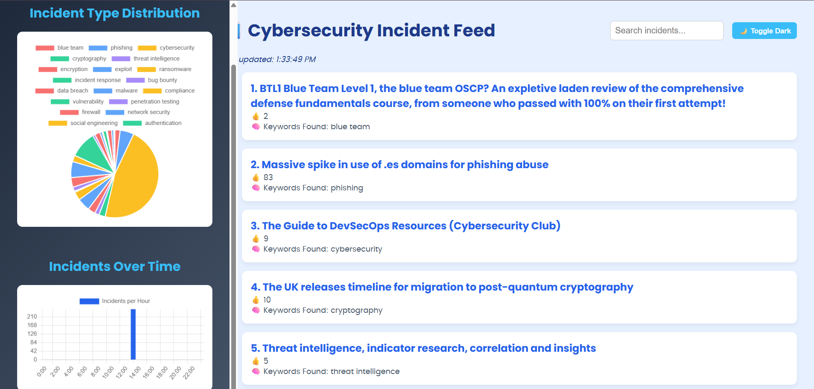

# 🛡️ Cybersecurity Incident Dashboard

A real-time web dashboard that visualizes cybersecurity incidents with live charts, keyword detection, and keyword-based search, complete with a dark mode toggle and animated preloader.



## To  View Live
https://cyber-blogs-crawler.onrender.com/

## 🔥 Features

- 📊 **Live Charts**: Visualize incident types and frequency over time using `Chart.js`.
- 🔍 **Search Functionality**: Filter incidents based on keywords or titles.
- 🌙 **Dark Mode**: Toggle between light and dark themes.
- 🔄 **Auto Refresh**: Automatically fetches new incident data every 60 seconds.
- ⏳ **Preloader**: Smooth animated spinner and message during data load.
- 📅 **Last Updated Time**: Shows the most recent fetch timestamp.
- ✅ Responsive and accessible design.

---

## 🚀 Tech Stack

- **HTML5**
- **CSS3** with CSS Variables
- **JavaScript (ES6+)**
- [**Chart.js**](https://www.chartjs.org/) for live data visualization

---

## 📁 Folder Structure
cybersecurity-dashboard/
│
├── app.py                     # 🔁 Main Flask (Python) backend file
│
├── 📁 templates/              # 🖼️ HTML files served via Flask
│   └── index.html 


---

## ⚙️ Setup Instructions

### 1. Clone or Download
```bash
git clone https://github.com/your-username/cybersecurity-dashboard.git
cd cybersecurity-dashboard

GET /fetch_posts
{
  "posts": [
    {
      "title": "Example Incident",
      "url": "https://example.com",
      "score": 42,
      "keywords": ["malware", "ransomware"],
      "timestamp": "2025-07-07T15:30:00Z"
    }
  ]
}

python app.py

from flask import Flask, render_template

app = Flask(__name__)

@app.route("/")
def home():
    return render_template("index.html")

@app.route("/fetch_posts")
def fetch_posts():
    # Replace with actual data fetching logic
    return {"posts": [...]}

